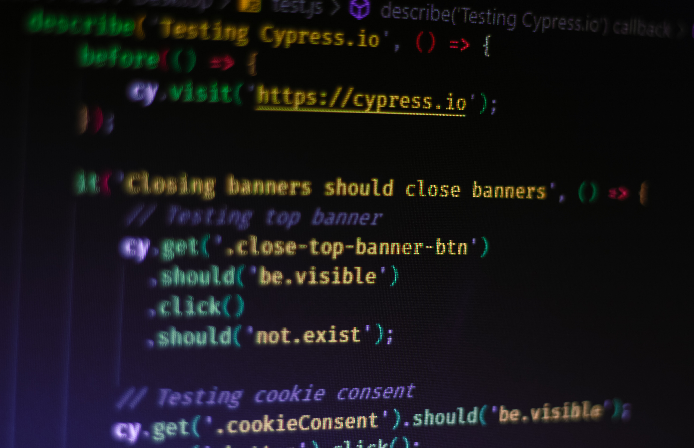

# React Testing Library


## What is React-Testing-Library

React Testing Library is a utility tool that builds on top of DOM testing library and will query the DOM the same way a user would.

A React application (created using **Create React App**) already have React Testing Library along with Jest but if you want to use it outside **Create React App** , it can be added using npm like:

```js
npm install --save-dev @testing-library/react
```

## Where we use React-Testing-Library

- Very often a concern that developers face is if their application works in the way it was intended to be. To check this tests are written. But we want our test to be maintainable for our React components. We want our testbase to be maintainable in the long run so refactors of your components  don't break your tests.

- The solution to this problem is React Testing Library which builds on top of DOM testing library and will query the DOM the same way a user would.This library will help you increasing the accessiblilty of your application and the closer you get you get your test to a user using the componenet, the more confident you will have that your application will work when a real user uses it.

- You should also keep in mind that React Testing library is not a test runner or a framework, it only provide method to write your test scripts, so you will need a testing framework like Jest

## Benifit of Reat-Testing-Library

- Prevents unexpected errors in our code and reduces the chances of code failure

- Regular testing prevents errors at the time of production.

- Reduces the need for manual testing.

- Allows developers to focus on their current task instead of fussing over previous task.

## Shortcomings of React-Testing-Library

- More code is required to be written

- Takes more time while testing

## Methods for Finding Elements
 
- `getByText()` : find the element by its text content in it

- `getByTitle()` : find the element by title attribute value

- `getByLabelText()` : find the element by its label attribute value

- `getByTestId()` : find the element byby data-testid attribute

- `getByRole()` : find the element by aria role

- `getByPlaceholderText()` : find the element by its placeholder attribute value

- `getByAltText()` : find the element by its alt attribute value

- `getByDisplayValue()` : find the element by its value attribute

## Conclusion
This was the very basic understanding of React Testing Library. From this point, you can refer below resources to have a clear understanding of react testing library.

## Resources
- [React Testing Library introduction](https://testing-library.com/docs/react-testing-library/intro/)
- [React Testing Library example](https://testing-library.com/docs/react-testing-library/example-intro)
- [React Tesing Library Setup](https://testing-library.com/docs/react-testing-library/setup)
- [React Tesing Library API](https://testing-library.com/docs/react-testing-library/api)
- [Migrate from Enzyme](https://testing-library.com/docs/react-testing-library/migrate-from-enzyme)
- [React Testing Library Cheatsheet](https://testing-library.com/docs/react-testing-library/cheatsheet)

